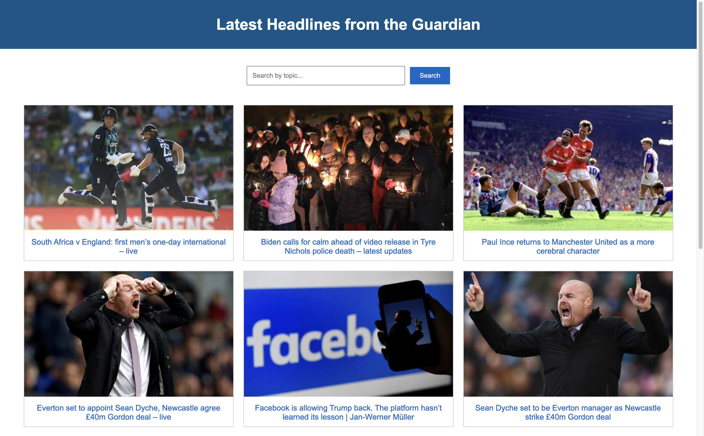

# News Headlines

## About this project
This is a frontend JavaScript web-app showing the latest headlines from the Guardian (and links to the full articles). The data for this website is fetched from the Guardian API.

## Getting Started
1. If not already installed, install Node Version Manager (NVM): ```brew install nvm```
2. If not already installed, install Node.js (version v19.4.0 at the time of writing): ```nvm install 19```
3. Clone the repository to your device
4. Enter the directory: ```cd bank-tech-test```
5. Activate node: ```nvm use node```
4. Run ```npm install```
5. Open the index.html file in your browser: ```open index.html```
6. Browse through the latest headlines on the homepage and search for news articles by topic by entering a query in the search bar and clicking the submit button or pressing enter
7. Type ```npx jest``` in the terminal to run tests

## Code Structure

The code is separated into three main parts:

1. Model: The NewsModel class is responsible for storing the news data. It contains methods for setting and getting this data.
2. View: The NewsView class is responsible for displaying the news data to the user. It creates the visual elements for each article and appends them to the DOM. It also handles user input by setting up event listeners on the submit button, search input, and enter key.
3. Client: The NewsClient class is responsible for making requests to the Guardian API and retrieving its news data.

By separating the application logic into these three distinct components, it makes the code more organised and easier to understand. It also allows for better separation of concerns, making it easier to make changes to one component without affecting the other components. This can lead to a more maintainable codebase and makes it easier to add new features or make changes in future.

## Screenshots

#### Homepage



#### Search for 'music'


